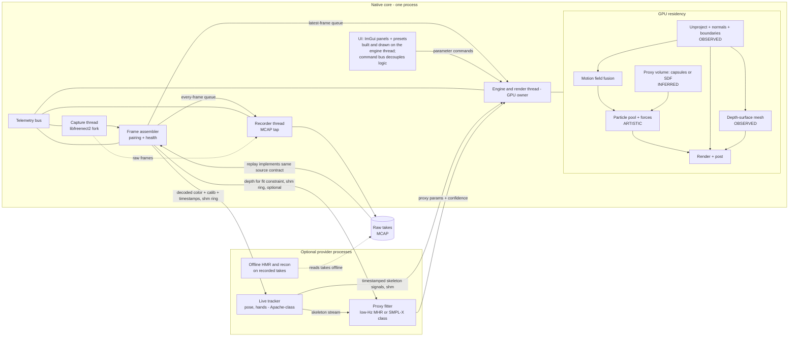

# 06 — Recommended Architecture

## Recommendation

**Option N: a C++20 native core** — pinned libfreenect2 fork (CUDA depth,
TurboJPEG color, VA-API off), CUDA/GL-compute for geometry + particles,
OpenGL 4.6 renderer with an explicit Vulkan escape hatch, Dear ImGui
control surface, MCAP recorder — **plus out-of-process providers**
(tracking, proxy fitting, offline HMR; Python allowed) speaking a
timestamped signal protocol over shared memory.

Why N over R (full comparison in
[05-architecture-options.md](05-architecture-options.md)): the three
riskiest integrations — sensor decode, hardware/optical flow, GPU interop
— are native to the C++/CUDA world; concurrency is deliberately reduced to
bounded queues, which shrinks Rust's safety premium; and the render/compute
budget on a 4 GiB T550 wants vendor-deep profiling (Nsight) more than
portability. Rust remains a respected alternative, not a wrong answer —
the deciding experiments (E1, E4) would even transfer if reversed early.

Gate: this recommendation was **not final until E1 + E4 passed** — and
they have **[measured 2026-07-29]**: E1 (30 Hz depth sustained, tee
verified; color-rate condition pending a lit room only) and E4 (target
grid point with >30% headroom, no API-shaped wall). The Option N stack is
confirmed. Details: [../experiments/E1.md](../experiments/E1.md),
[../experiments/E4.md](../experiments/E4.md).

## System diagram

Geometry provenance is explicit in the diagram: UNP/DSM are **observed**,
TRK signals are **tracked**, PROXY is **inferred**, PART is **artistic**.
Render may blend them; nothing may relabel them.

## The load-bearing contracts

1. **Source contract** — live sensor and take replay are indistinguishable
   downstream (`RgbdFrame v1`, [01 §7](01-sensor-and-rgbd-foundation.md)).
2. **Semantic layer tags** — every geometry buffer carries
   observed/tracked/inferred/artistic provenance
   ([03 §0](03-mesh-and-body-completion.md)).
3. **Motion field** — one fused velocity+confidence product; consumers
   never know the algorithm ([02 §3](02-living-point-field.md)).
4. **Signal protocol** — providers deliver `(t_capture, t_produced,
   confidence, payload)`; the engine interpolates/extrapolates and *shows*
   staleness rather than hiding it. Input to providers is push-only over a
   shared-memory ring with drop-oldest semantics: a slow or dead provider
   loses frames, never backpressures the core. The tracker additionally
   feeds the proxy fitter (skeleton stream) so FIT does not re-derive
   pose. UI note: ImGui is immediate-mode and lives on the GL-owning
   engine thread (event pump, frame build, draw submission all there); the
   "UI" box is a logical role, decoupled through the parameter command
   bus, not a second GL thread.
5. **Parameter schema** — typed/ranged/versioned; a preset + a take +
   a seed = a deterministic re-render (GPU tolerances documented).
6. **Telemetry** — capture Hz, skew, queue high-water, GPU pass times,
   recorder backlog, provider staleness: visible in one overlay from the
   first slice (the brief's trust requirement).

## Degradation ladder (designed, not accidental)

| Condition | Behavior |
| --- | --- |
| Providers absent | full observed + artistic looks; inferred modes greyed with reason |
| Tracking dropout mid-performance | body-local particles release to world-local (aesthetic failure mode, per look #5) |
| Flow unavailable (NVOFA absent, DIS over budget) | motion field falls back to skeleton + finite-difference terms; confidence reflects it |
| GPU budget exceeded | ordered shedding: resolution scale → particle cap → shell count; never capture or recording |
| Recorder pressure | bounded queue + explicit loss events; viewport never blocks |
| Sensor unplugged | replay mode remains fully functional (same contract) |

## Memory budget sketch (planning numbers → E4 measures the truth)

*Engine-owned VRAM:* observed geometry ~30 MB · particle pool (1M SoA)
~96 MB · history shells (8× depth) ~7 MB · motion field ~10 MB ·
framebuffers/post ~150 MB · UI/misc ~50 MB → ≈350 MB.

*Deliberately **not** in that number, and known to be nonzero:* decoded
1080p color pools and compressed-JPEG queues (CPU + upload staging),
CUDA↔GL interop duplication, libfreenect2's internal USB/processing
buffers, recorder backlog (CPU RAM, bounded by queue depth), provider
processes (own budgets, own processes), and driver/compositor overhead on
a hybrid Intel+NVIDIA laptop — the last is opaque and historically
surprising. **[measured 2026-07-29, E4]:** the hypothesis held — full-process RSS
high-water 411 MB and 3.63 GiB VRAM free at the heaviest grid point with
capture + decode + record + render in one process. Memory is retired as a
foundation risk ([../experiments/E4.md](../experiments/E4.md)).

## What is deliberately not in the core

No visible node editor (internal graph only). No ML in-process. No
watertight-avatar promises. No web runtime. No custom recording container
unless MCAP fails its spike ([08](08-recording-and-outputs.md)).
