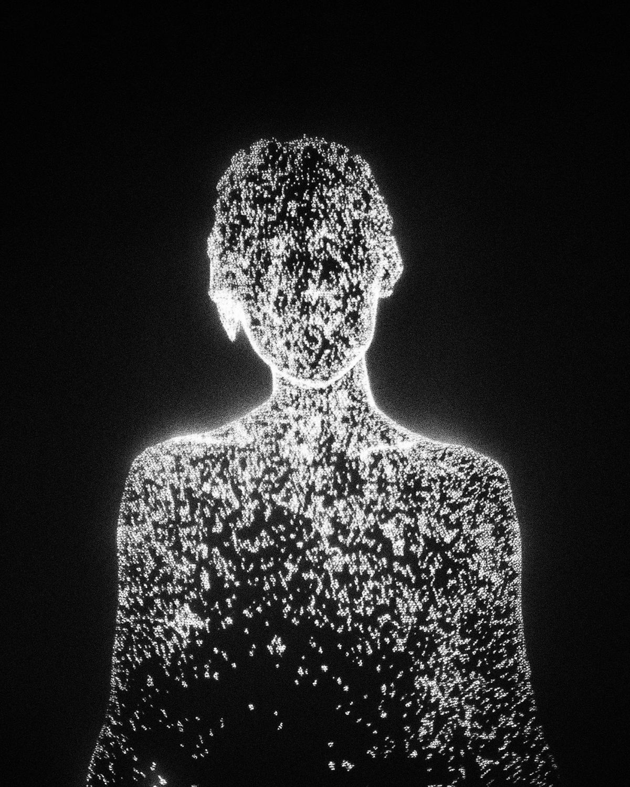
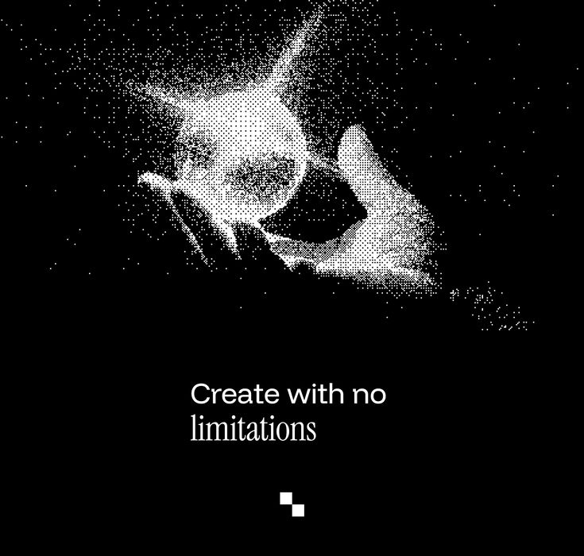
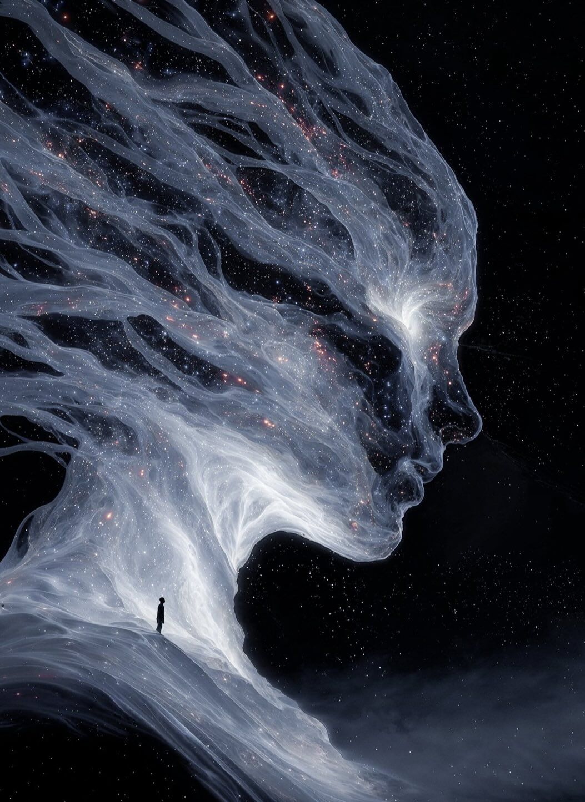
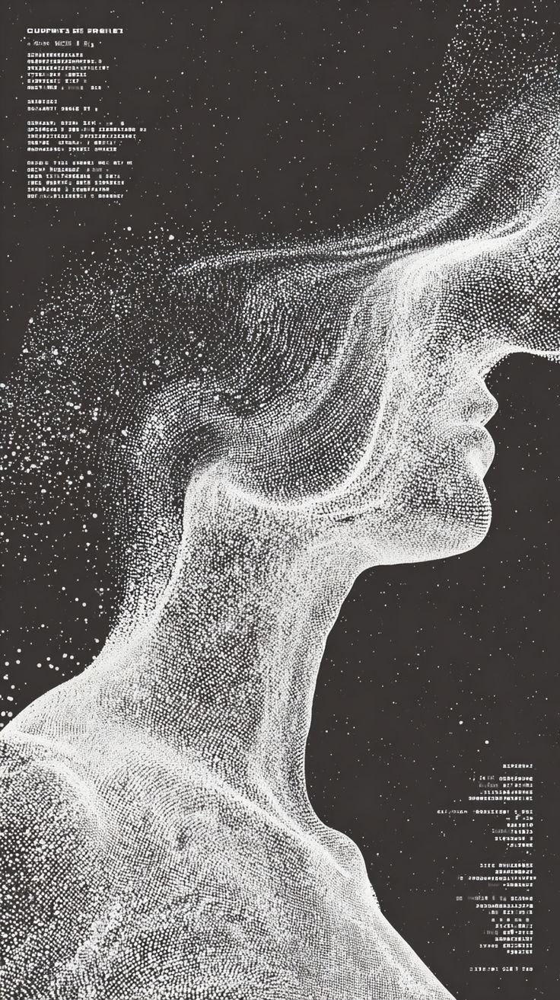

# Mood Board

These files are durable copies of the four images supplied at project kickoff.
They are visual north stars, not screenshots to reproduce literally.

## Images

### 01 - Luminous human point cloud

Useful qualities:

- readable human silhouette without a solid surface;
- dense and sparse regions coexisting;
- white-hot contour against near-black space;
- grain and bloom that feel photographic rather than like uniform GPU dots.

### 02 - Dispersing hands

Useful qualities:

- points that detach from a tracked form;
- spatial falloff and directional dispersion;
- hands as both subject matter and possible control input;
- extremely restrained typography and interface presence.

### 03 - Ethereal flowing profile

Useful qualities:

- a coherent face emerging from flow fields and translucent ribbons;
- trails that express form instead of merely blurring it;
- layered particles, filaments, mist, and occasional warm sparks;
- a possible destination beyond literal point-cloud rendering.

### 04 - Dense particle profile

Useful qualities:

- very dense sampling that approaches a surface;
- controlled breakup around hair and silhouette edges;
- monochrome editorial treatment;
- room for subtle technical metadata without turning the artwork into a debug
  screen.

## Shared Direction

The common language is spectral, high-contrast, human, granular, and fluid.
Important variation comes from density, coherence, temporal memory, and
directional forces—not from indiscriminate neon color.

The system should eventually make this range possible through parameters and
operators rather than a collection of one-off hardcoded scenes.

## Provenance and Usage

These images were supplied by Caden at project kickoff; their original
sources, authors, and license terms were not recorded. Treat them as
**internal creative reference only** — do not redistribute them or ship
them in any public/cloneable form of this repository until provenance and
rights are established. (Tracked as part of the cloneable-future decision
in `docs/discovery/10-open-decisions.md`.)

## Asset Integrity

| File | Dimensions | SHA-256 |
| --- | ---: | --- |
| `01-luminous-human-point-cloud.png` | 1200 x 1500 | `d46edc7d38a428b6ff6f38e40f7611e462b6b3a1fbd0f9365f2c258cf999f0b3` |
| `02-dispersing-hands-point-cloud.png` | 735 x 700 | `9bb13bd2f36be642419ac58f7a4dd55acf7a98ea277ca8f5fc5c15680cf6df06` |
| `03-ethereal-flowing-profile.png` | 1053 x 1445 | `ff1d0e8076f39fe65113c8ecdcff7b5e2ecf6d67db7cbeeb1260f5bad1124c4f` |
| `04-dense-particle-profile.png` | 736 x 1313 | `bca701c0e17b542350ecc8359925b194942a0b98bbf812500453b7230b5fe5fd` |
